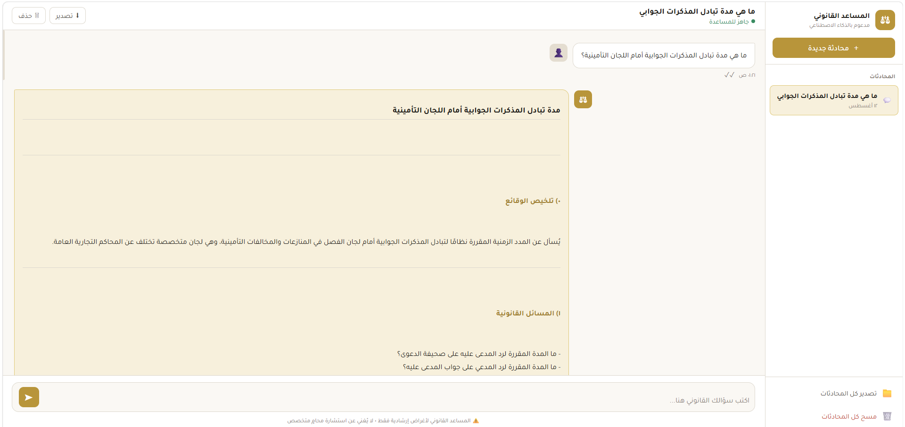
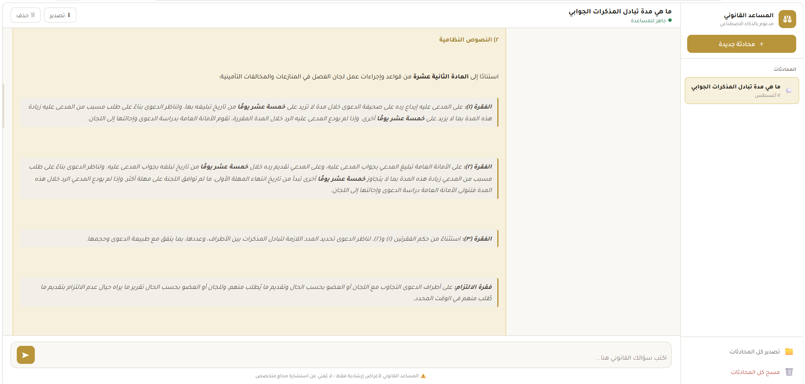
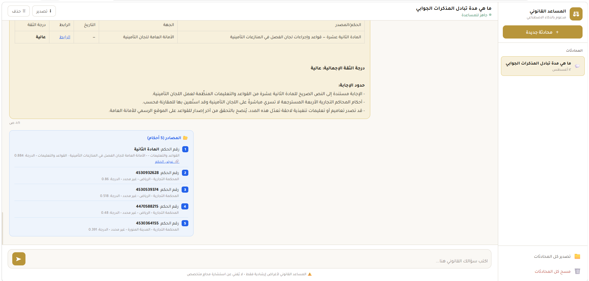

# Saudi Legal AI Assistant — RAG-Powered Legal Research

**Python · FastAPI · Claude · Cohere · Pinecone · Railway**

## 📌 Overview

An AI-powered legal research assistant specialized in Saudi Arabian court decisions and regulatory frameworks. The system enables lawyers and legal professionals to search and analyze over 540,000 indexed legal chunks using natural language queries in Arabic, spanning judiciary, securities, and insurance domains.

## 🏗️ Architecture

```
User Query (Arabic)
        ↓
Cohere Multilingual Embeddings
        ↓
Pinecone Vector Search (7 namespaces, queried in parallel)
   ├── Ministry of Justice — MOJ (__default__)
   ├── Board of Grievances — BOG (ديوان المظالم)
   ├── CRSD — Securities Disputes (لجنة الأوراق المالية)
   ├── CRSD — Legal Principles (المبادئ القضائية)
   ├── Insurance Authority Regulations — IA (هيئة التأمين)
   ├── Council of Health Insurance Regulations — CHI (مجلس الضمان الصحي)
   └── Insurance Disputes Committee — IDC (لجان الفصل في المنازعات التأمينية)
        ↓
Two-phase retrieval:
   • Case-based namespaces (MOJ/BOG/CRSD/Principles) → full case re-fetch by case ID
   • Regulation namespaces (IA/CHI/IDC) → direct chunk retrieval (self-contained units)
        ↓
Cohere Reranker (multilingual)
        ↓
Claude Sonnet — Structured Legal Analysis & Answer Generation
        ↓
Streaming Response (SSE) to User
```

## 📊 Data Scale

| Source | Namespace | Vectors (Chunks) |
|---|---|---:|
| Ministry of Justice (وزارة العدل) | `__default__` | 323,340 |
| Board of Grievances (ديوان المظالم) | `bog` | 150,455 |
| CRSD — Securities Disputes | `crsd` | 48,877 |
| CRSD — Legal Principles | `crsd-principles` | 589 |
| Insurance Authority Regulations | `ia-regulations` | 6,378 |
| Council of Health Insurance Regulations | `chi-regulations` | 10,284 |
| Insurance Disputes Committee | `idc-regulations` | 1,443 |
| **Total** | | **541,366** |

## 🛠️ Tech Stack

| Layer | Technology |
|---|---|
| Embeddings | Cohere `embed-multilingual-v3.0` |
| Vector DB | Pinecone (7-namespace index: `legal-case`) |
| Reranking | Cohere `rerank-multilingual-v3.0` |
| Generation | Anthropic Claude Sonnet |
| Backend | FastAPI (Python) |
| Frontend | Vanilla JS + Arabic RTL UI |
| Scraping | Playwright + PyMuPDF / BeautifulSoup |
| Deployment | Railway (auto-deploy from GitHub) |

## ✨ Key Features

- 🔍 **Multi-source parallel search** across 7 legal and regulatory databases simultaneously (judiciary, securities, and insurance)
- 🌊 **Streaming responses** — answers appear word by word in real time
- 📜 **Structured legal analysis** with mandatory sections: وقائع، مسائل قانونية، نصوص نظامية، تطبيقات قضائية، شروحات، خلاصة وتوصية
- 🔗 **Source citations** with direct links to original court decisions and regulatory documents
- 🗣️ **Fully Arabic interface** with RTL support
- 💬 **Conversation history** for contextual follow-up questions
- ⚖️ **Legal principles integration** from CRSD appeals committee
- 🏥 **Insurance regulatory coverage** — Insurance Authority regulations, Health Insurance Council rules, and Insurance Disputes Committee decisions, unified into the same retrieval pipeline as court judgments
- 🧩 **Adaptive retrieval logic** — case-based sources get full-case reconstruction via case-ID re-fetch; regulation sources are retrieved as self-contained chunks (articles/circulars/policy sections), since they don't fragment across a larger case

## 🖥️ Example: Full Legal Analysis in Action

Query: "ما هي مدة تبادل المذكرات الجوابية أمام اللجان التأمينية؟" (What is the timeframe for exchanging response memoranda before insurance committees?)

1. Structured Answer — Facts & Legal Issues
The assistant summarizes the facts and identifies the legal questions before citing any source text.


2. Real Case Citations in Context
The assistant doesn't just state the rule — it cross-references it against actual retrieved court judgments (case numbers included), showing how commercial courts have applied similar timeframes in practice, with a clear note distinguishing statutory text from case-law comparison.


3. Confidence Score & Ranked Sources
Every answer ends with an overall confidence rating and a transparent list of the exact judgments/regulations used, each with a relevance score from the reranking step — so every claim in the answer is traceable back to its source.



## 🔄 RAG Pipeline (simplified)

```python
# 1. Embed the query
query_vector = cohere.embed(query, model="embed-multilingual-v3.0")

# 2. Search all 7 namespaces in parallel
with ThreadPoolExecutor(max_workers=7) as executor:
    results = [
        executor.submit(pinecone.query, namespace=ns, vector=query_vector)
        for ns in ["__default__", "bog", "crsd", "crsd-principles",
                   "ia-regulations", "chi-regulations", "idc-regulations"]
    ]

# 3. Case-based sources: re-fetch full case by ID
#    Regulation sources: used directly as retrieved

# 4. Rerank combined results
reranked = cohere.rerank(query=query, documents=all_chunks, top_n=5)

# 5. Generate structured legal answer
answer = claude.stream(
    system=LEGAL_SYSTEM_PROMPT,
    context=build_context(reranked)
)
```

## 📁 Data Pipeline

```
Web Scraping (Playwright + BeautifulSoup)
        ↓
PDF/HTML Extraction (PyMuPDF / structured parsing)
        ↓
Arabic Quality Filtering
        ↓
Text Chunking (with overlap)
        ↓
Cohere Embeddings
        ↓
Pinecone Upsert (per-source namespace)
```

## ⚠️ Disclaimer

This tool is for legal research assistance only and does not constitute legal advice. Always consult a licensed legal professional.
